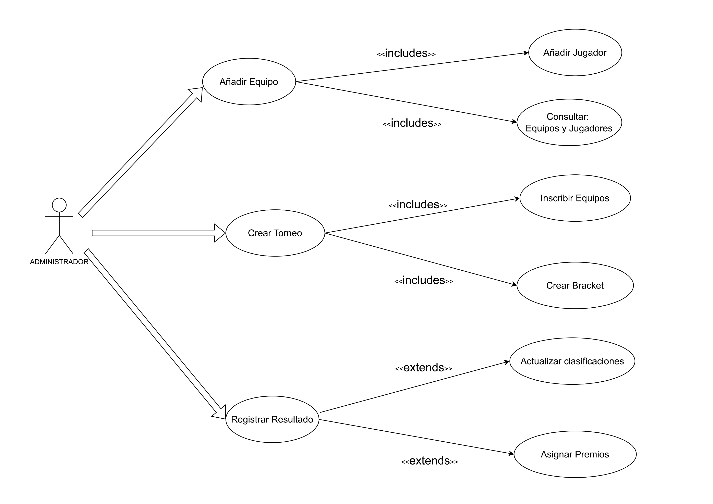
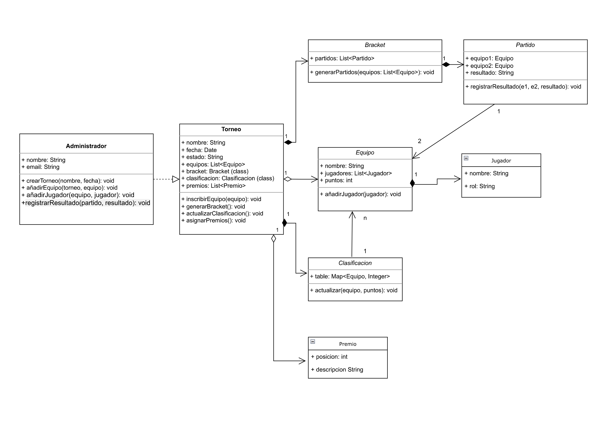

# Sistema de Gestión de Torneos de eSports
## Autor
Xavier Valverde Fernández  
[Mi perfil de Github](https://github.com/XavierValverde)
## Descripción del Proyecto
Link al repositorio del proyecto  
[Link al repositorio del proyecto](https://github.com/XavierValverde)  pues 
Este proyecto implementa un sistema de gestión de torneos de eSports
utilizando UML para el modelado y Java para la implementación.
## Diagramas UML
### Diagrama de Casos de Uso

### Diagrama de Clases

## Estructura del Proyecto
torneo-esports-uml/   
├── src/    
│ ├── es/empresa/torneo/  
│ │ ├── modelo/  
│ │ │ ├── Equipo.java  
│ │ │ ├── Jugador.java  
│ │ │ ├── Partido.java  
│ │ │ ├── Bracket.java  
│ │ │ ├── Clasificacion.java  
│ │ │ └── Premio.java  
│ │ │  
│ │ ├── control/  
│ │ │ └── Torneo.java  
│ │ │  
│ │ ├── vista/  
│ │ │ └── Administrador.java  
│ │ ├── Main.java  
├── diagrams/  
│ ├── casos-uso.png  
│ ├── clases.png  
├── README.md  
├── .gitignore  
├── LICENSE (opcional)  

## Instalación y Ejecución
1. Clonar el repositorio:
   `git clone https://github.com/usuario/torneo-esports-uml.git`
2. Compilar y ejecutar el proyecto:
   `cd src javac es/empresa/torneo/Main.java java es.empresa.torneo.Main`
## Justificación del diseño
Por qué se eligió esa estructura y cómo se organizan las clases.
## Conclusiones
Sobre el aprendizaje obtenido.

### Subtítulo
Este es un ejemplo de texto que da entrada a una lista genérica de elementos:
- Elemento 1
- Elemento 2
- Elemento 3
  Este es un ejemplo de texto que da entrada a una lista numerada:
1. Elemento 1
2. Elemento 2
3. Elemento 3
   Al texto en Markdown puedes añadirle formato como **negrita** o *cursiva* de una manera muy sencilla tambien en ***cursiva y negrita***.

+ elemento lista
    + lista anidada 
    + lista anidada 2

 http://limni.net/blog/

